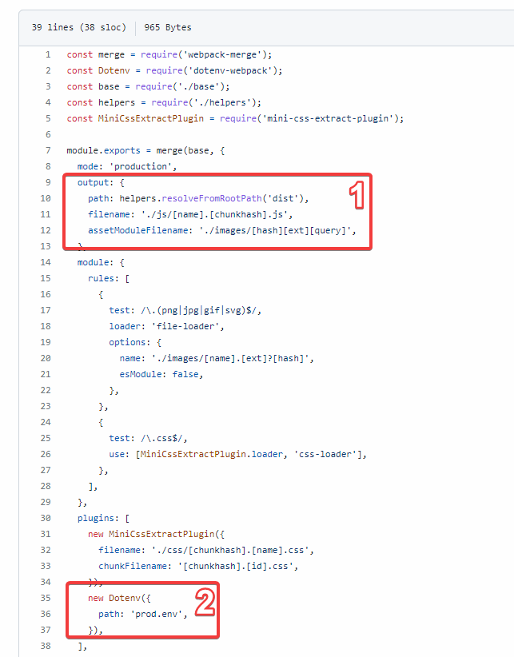
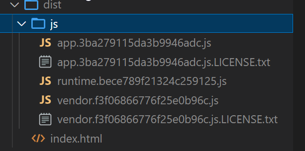
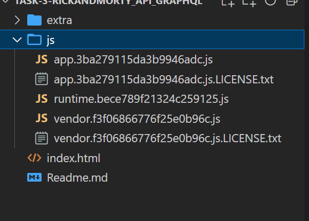
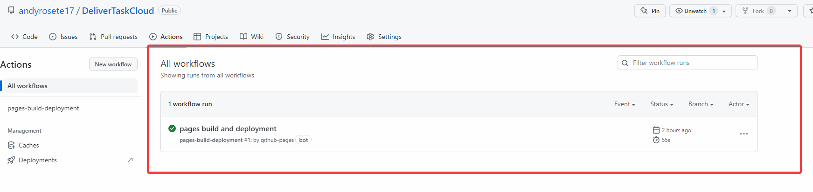
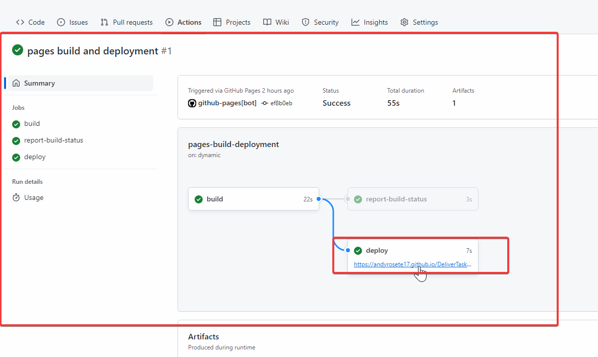

# Cloud module lab

## Task: Implement manual deployment using github gh-pages

### Steps:

- Prepare master branch with the proper configuration of the webpack config for production environment.
   1. Output configuration indicating where to save the build files (dist), and also the javascripts files and images files 2. Where is placed the file for production configuration.

- In the package.json is important to add the build commands

```bash
 "build": "npm run type-check && npm run clean && npm run build:prod",
    "build:prod": "webpack --config ./config/webpack/prod.js",
    "type-check": "tsc --noEmit",
    "type-check:watch": "npm run type-check -- --watch",
    "clean": "rimraf dist",
```

- Once the base setup is ready, you should be able to run a

```bash
yarn build
```

The result of the build should be a new folder in the root path 



* From this point you can create a new branch called *"gh-pages"*\
In this branch will only necessary to left the dist folder content


* Publish the code and in github actions you should be able to see a new workflow activated


* Click on it and you should be able to see the new url generated to test your code


* If you click on that link you should be able to see the final result
